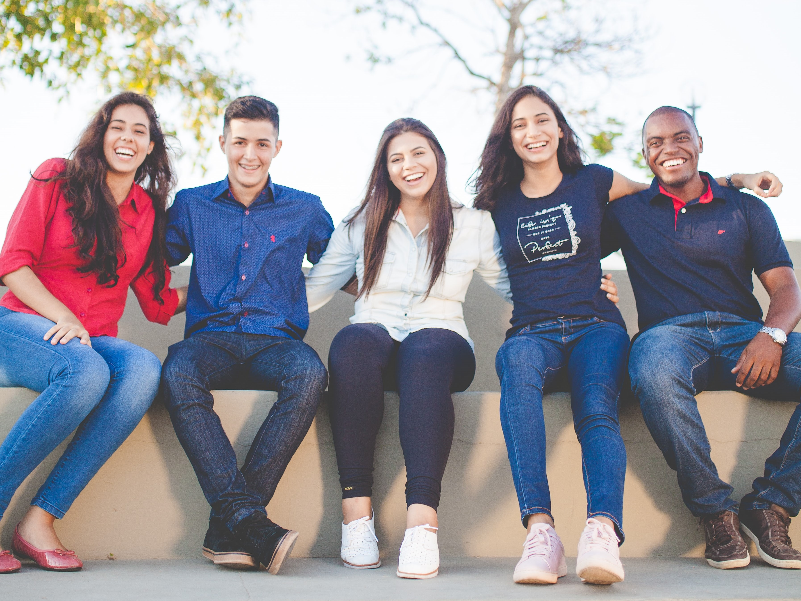
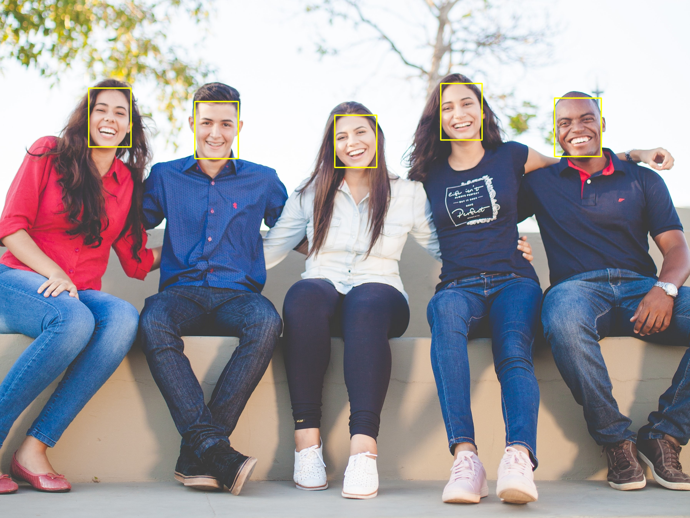

# Face Detection with YOLOv5

Training results for [YOLOv5](https://github.com/ultralytics/yolov5) models(yolov5n6 and yolov5s6) on dataset consisting of faces for face detection. The models were then converted to ONNX files to make inference faster and easier using [ONNXRuntime](https://onnxruntime.ai/).

Test image :

`yolov5n6` model inference :

`yolov5s6` model inference :

